# Connections

I recently built a web page that implements the Connecting Wall from the quiz show Only Connect.  This was an entertaining little project that gave me an opportunity to explore some of the newer features in JavaScript and CSS.  What follows is a write up of that project, an insight into the goals I set and decisions I made.

## Background

Last year, when we were all asked to stay at home, like many others my friends and I decided Wednesday night would become web conference quiz night.  In our version of quiz night each participant would prepare ten questions and we would each take it in turns to be question master while the others scribbled down their answers.

Months later and in desperate need of a format change one of our group decided to instead design a Connecting Wall as you would see in the quiz show Only Connect.  For those that are not familiar with the show, in this round the contestants are given sixteen clues which they must group into four sets of four.  Some of the clues might seem to belong to more than one group but there is only one perfect solution.

An example wall before solving would look like this:

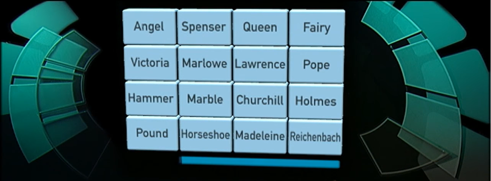

That same wall would look like this when solved:

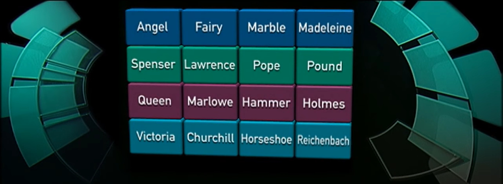

In this example the connections are: cakes; poets; fictional detectives and waterfalls.

This show is notoriously difficult but this round is more puzzle like than the others so I was excited to give it a go.  The problem I quickly realised was that an already ticky puzzle gets harder when you don’t have the nice interactive board.  On the show the contestants get to select four of the clues and if it’s a valid group they change colour and move to the top of the wall.  If it was not a valid group, there is no doubt it’s incorrect as the selection is cleared and they get to try again.  With the overlapping connections and red herrings, this trial and error is an integral part of the puzzle.

In our web conference version, the 16 clues were just read out and I had to try to move the clues around in my head and on a scrap of paper.  There was no feedback if an initial selection was correct or not.  I had to just keep trying combinations until I had four sets of four that worked.

Everyone enjoyed the round, especially when it all started to click into place.  The author said he was devising a second wall and I saw this as a challenge, write a web site to provide the same interactive experience as seen on TV.  I could have done a Google search to see if anyone else had already done this ([they have](https://www.puzzgrid.com/)) but this was an opportunity to flex my developer muscles.

## Objectives

The web applications I develop at work all use an internally developed library that was initially written over ten years ago.  The web has changed a lot in that time and some of the functionality our library provides to smooth out the inconsistencies between web browsers is no longer necessary.  Some of the extra features it offers are now baked into the browser.

I wanted to re-familiarise myself with core JavaScript and CSS, experiment with new features and to see where our library and others are still adding value.  So for this project, I decided not to use any libraries, just native JS and CSS.

The site itself needs to look good and replicate the feel of the show.  I would argue the most important aspect of this is how the wall animates when a valid group is selected.  The site also needs to work on computers, tablets, phones in both horizontal and vertical orientations as my friends are using a bunch of different devices.

I also want this to be a stand alone page that can be served on any basic web server, no server side scripting, no databases.  That said I still want to build an editor so my friends can author walls and share them with me and each other, so no hard coding either.  Spoiler alert: we are going to have to encode the puzzle config into the URL.


## The HTML

The HTML for the site is a bare bones page.

```html
<!DOCTYPE html>
<html lang="en">
	<head>
		<meta charset="utf-8">
		<title>Only Connect</title>
		<link rel="stylesheet" href="only-connect.css">
		<script src="only-connect.js"></script>

		<meta name="viewport" content="width=device-width,
			initial-scale=1, maximum-scale=1, user-scalable=0"/>
	</head>
	<body>
		<script>
			wall( /* data here ? */ );
		</script>
	</body>
</html>
```
It’s main purpose is to load the CSS and JS and then call a JS function to add content.  I decided to build the content of this site using JS instead of directly in the HTML for three reasons:

1. The content of the page is repativie, a grid of sixteen elements, using JS means I can use a loop to generate the content.
2. The content is not known at the time of development, the actual text will be different for each puzzle.  I would therefore have to use JS to manipulate the HTML elements even if they were already defined in the HTML.
3. The content is interactive, it needs to respond to user input and move around the screen.  This means the JS needs references to many of the elements so they can be manipulated and/or moved around the DOM tree.

The process for generating HTML content has not changed much over the last 10 years.  You still need to create an HTML element, find the parent element in the DOM tree and insert or append the new element to the parent.

HTML elements have a new append method which can be called in place of appendChild.  The append method differs slightly in that it allows you to add both Nodes and DOMStrings.  You can also send multiple arguments to append multiple Nodes/DOMStrings in one call.   In comparison to appendChild which returns the node that was appended, the new append method returns nothing.

Manipulating CSS classes has improved.  Elements now have a classList property that returns a DOMTokenList which has methods for adding, removing and querying classes.  This is much neater than the string manipulation of the className property that used to be required, and a good example of several utility functions that are no longer required in the library at work.

While not terribly verbose, the code required to create an element, add it to the DOM and give it a CSS class is a few lines long and something I would be doing quite frequently.  Therefore I created a short function to help me do this.

```javascript
function html(parent, tag, cssClass, content) {
	let child = parent.appendChild(document.createElement(tag));
	if(cssClass) {
		child.classList.add(...cssClass.split(" "));
	}
	if(content) {
		child.innerHTML = content;
	}
	return child;
}
```

This function takes advantage of the new spread syntax (...) to turn the array of CSS classes into arguments for the classList.add() method.  This was the first time I’ve used this syntax and it is more convenient than calling the apply method as would have done in the past.

## The Layout

To create the four by four grid for the wall, old me would have used a table or messed around with floating divs.  Slightly newer me would have used flex but CSS now has a layout called grid, it would be rude not to test it out.  I created a div with a class of “wall” and added sixteen “brick” elements to it.  I set the display property of the wall to grid and the rest was refreshingly straightforward to define.  The gap properties just work as you would expect and defining the column/row widths as fractions of the available space with the fr unit meant there was no messing around with overflow.

I particularly liked not needing to worry about adding a row or column structure for the brick HTML elements and just defining the number of columns in the CSS.  Later when I need to manipulate the order of these elements, it will be much simpler to move elements in a single list compared to a nested structure.

```css
.wall {
	display: grid;
	grid-template-columns: repeat(4, 1fr);
	gap: 10px 10px;
	padding: 10px;
}
.brick {
	border-radius: 5px;
	color: #1D3C4C;
	background: #91C3E4;
}
```

As a placeholder I used the following code to generate the HTML.  This hardcoded array will be replaced with something more useful later.

```javascript
// build html
let playarea = html(document.querySelector("body"), "div", "playarea");
let wall = html(playarea, "div", "wall");
[
	"Queen","Holmes","Reichenbach","Hammer",
	"Angel","Victoria","Churchill","Marlowe",
	"Fairy","Spenser","Lawrence","Madeleine",
	"Pound","Horseshoe","Pope","Marble"
].forEach(function(clue) {
	let brick = html(wall, "div", "brick");
	html(brick, "span", "", clue);
});
```

Which produced a wall that looks like this:

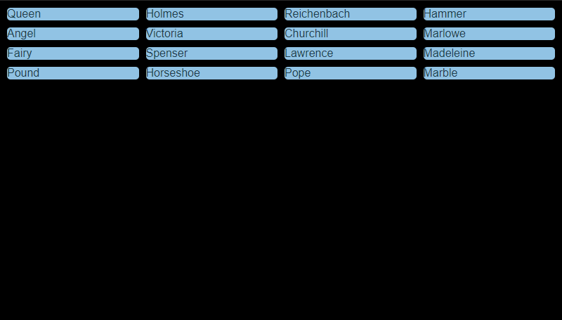

The width of the bricks is driven by the width of the grid and therefore the width of the screen, I’m happy with this.  The height however is driven by their content and I wanted instead to make the wall and bricks a constant aspect ratio and size the content to fit the brick.

Disappointingly I could not find a CSS property to control aspect ratio.  There are a few well documented tricks though and the seemingly most popular option is to use padding-top set to a percentage value.  The trick here is the padding-top percentage is calculated based on the element's width.  This allowed me to set the height of the element relative to its width, in my case setting the padding-top to 56.25% gave me a 16:9 aspect ratio.  A child div is then absolutely positioned inside the container for the content.  This worked ok initially but I hit problems later on when animating the bricks so I was starting to believe I would need to use JavaScript to solve this problem.

Getting the content to fit the container also proved to be difficult with pure CSS.  There is an object-fit property that controls how content should be sized to fit its container, but this only applies to replaced elements such as images and canvases.  In my case the content is text and I want the font size to scale to fit.  I tried using the vh units in font-size property to set the font size relative to the screen height and after some trial and error got acceptable results on my computer with browser windows at various sizes.  When I tested it on my phone it worked if my phone was in landscape, but when I switched to portrait the text became too large.  If I calibrated the font size to work on a portrait screen it became too small in landscape.

The problem is using the vh or vw units for the font size makes it relative to the viewport and not it’s container.  Reluctantly I decided I would have to use JavaScript to compute the font size.  This gave me the opportunity to use another new feature for me, the observers.

It is not enough to compute the font size when the page loads, you also need to re-compute the size whenever the container changes size.  This would typically happen if the user resizes the browser window, maximises or restores the window and on a phone if the device is rotated from landscape to portrait.  The window has a resize event so it’s a simple enough task to add a listener to this event to re-compute the font size when needed.

However the container can also change size if other elements on the page are added, removed or otherwise manipulated.  I’m planning on doing this later for displaying the links between the clues for each group.  This would not trigger the window resize event but could need the font size to be recomputed.  As these manipulations would normally be triggered by JavaScript I could also trigger the same resize listener when I thought it was necessary and if I remember to add the call.  In my experience it’s not always clear if it is necessary as the last action may not have changed the size or shape of anything but to be on the safe side would trigger the listener anyway.

There is a considerable chunk of code in the library at work dedicated to tracking transient elements and triggering resizing to remove the burden of remembering/deciding from the developer.  The newish observer API removes a lot of this hassle as it allows you to monitor the size (among other things) of an element just as you would the window.

The resulting JavaScript is quite simple.  The first line of the function sets the wall’s height based on it’s width, keeping the constant aspect ratio of 16:9.  The second line sizes the font based on the available height.  This is all wrapped in a resize observer linked to the wall element and the browser will call the function whenever it is required.

```javascript
(new ResizeObserver(function() {
	wall.style.height = (wall.offsetWidth * 0.5625)+"px";
	playarea.style.fontSize = (wall.offsetHeight/16)+"px";
})).observe(wall);
```

The result is the wall now takes up the available vertical space and the font size is better, but I need to do some work on the bricks.

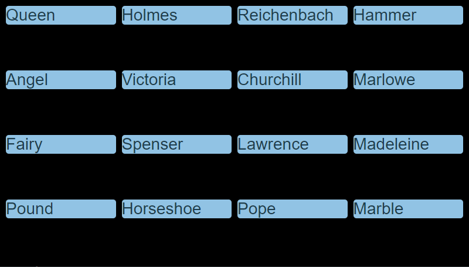

To get the bricks to use the available space in each cell is a simple matter of making their height 100%.  I also used the flex layout to center the text in each brick horizontally and vertically.

```css
.brick {
	border-radius: 5px;
	color: #1D3C4C;
	background: #91C3E4;

	height: 100%;

	display: flex;
	flex-flow: column;
	justify-content: center;
	align-items: center;
}
```

With this code I am happy with how the wall looks.  More importantly it looks consistent on any number of screen sizes and orientations.

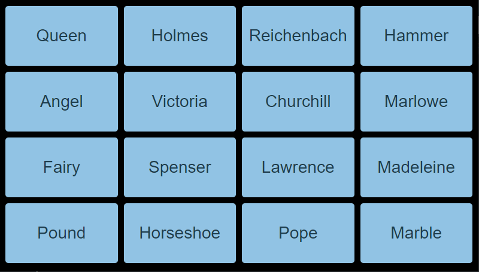

An additional note regarding layout.  You may have spotted the HTML page contains a viewport meta tag, this is to prevent any scaling on mobile devices.  In effect this moves the responsibility of scaling from the phone’s browser to my CSS, I found this to give more predictable results.

## Data Wrangling

For each group of four clues I would need the clues and the link that joins them together.  I replaced the array of 16 clues I’ve been using up to now with an array of four objects, each with a link property and an array of its four clues.  For now this is still hardcoded, I’ll deal with loading the data dynamically later.

```javascript
let groups = [
	{
		"link":"Cakes",
		"clues":["Angel","Fairy","Marble","Madeleine"]
	},
	{
		"link":"Poets",
		"clues":["Spenser","Lawrence","Pope","Pound"]
	},
	{
		"link":"Fictional detectives",
		"clues":["Queen","Marlowe","Hammer","Holmes"]
	},
	{
		"link":"Waterfalls",
		"clues":["Victoria","Churchill","Horseshoe","Reichenbach"]
	}
]
```

While this arrangement is convenient for storage/input, as there is no duplication of the link data, it is not so convenient for building the wall where I want to deal with a flat list of bricks.  I therefore need some code that translates from one format to the other.

Classic me would achieve this translation with a pair of nested loops.  I would even pat myself on the back for using the “new” forEach function.  The code would look something like this:

```javascript
// Turn the groups data into a lists of bricks
var bricks = [];
groups.forEach(function(group) {
	group.clues.forEach(function(clue) {
		bricks.push({
			clue: clue,
			link: group.link
		});
	});
});
```

However the forEach is not the only array function that has been added in the last decade and I’ve been guilty of over using it when there are probably more appropriate options.  After a quick read of an up-to-date reference I decided to take advantage of flatMap and map.  The new code looks like this:

```javascript
// Turn the groups data into a lists of bricks
var bricks = groups.flatMap( (group) =>
	group.clues.map( (clue) => ({
		clue: clue,
		link: group.link
	}))
);
```

Structurally these are very similar.  The second example has slightly less code and benefits from indicating the intention of the code, i.e. we are mapping data not just looping through an array.  I’m also led to believe that flatMap and map are going to be more efficient than the generic forEach loops, however in my tiny example it is not noticeable.

Next I needed to randomise the order of the bricks.  I checked to see if this is something that is now built-in for arrays, I couldn't find anything.  I therefore used an algorithm I’ve used before.  This method picks a random element from the array and moves it to the end of the array.  It then repeats this process for all but the last element of the array, moving the randomly selected element to the second to last place.  This continues with an ever decreasing slice of the array until the slice is only one element long.

```javascript
function shuffle(array) {
	for(var i=array.length-1; i>0; i--) {
		let rand = Math.floor(Math.random() * (i+1));
		let temp = array[rand];
		array[rand] = array[i];
		array[i] = temp;
	}
	return array;
}
```

This may not be the most efficient method, but it is effective and on such a small array is fast enough.

I replaced the placeholder code from earlier to loop through the bricks array to generate the HTML.  I also save a reference to the DOM node for the brick in the array so I can access/manipulate it later.

```javascript
// build html
let playarea = html(document.querySelector("body"), "div", "playarea");

let wall = html(playarea, "div", "wall");
bricks.forEach(function(brick) {
	brick.html = html(wall, "div", "brick");
	html(brick.html, "span", "", brick.clue);
});
```

## Player Input

I need to know when the player clicks on a brick.  Thankfully registering an event listener is something that gained standardisation since I started web application development in 2007.  Back then you had to use attachEvent for some browsers and addEventListener for others.  It was more than just a different name, the event object was also subtly different.  I wrote a library function to smooth over these differences and have been using it ever since even though the addEventListener version has been standard for some years now.

In my initial version of this code, I added a single listener to the wall element and then used the event objects target property to find the brick that triggered the click event.  Adding a single event listener to the parent element instead of multiple children elements is a habit I formed to try and avoid performance problems and memory leaks, especially in older browsers.

```javascript
wall.addEventListener("click", function(event) {
	var el = event.target;
	while(!el.classList.contains("brick") && el!=wall) {
		el = el.parentNode;
	}
	if(el.classList.contains("brick")) {
		selectBrick(bricks.find(brick => brick.html == el));
	}
});
```

On reflection however, I decided adding a listener to each brick would be both simpler code and more efficient as I would not need to step through the DOM Tree or search the bricks array.  My concerns about the performance of multiple listeners is probably invalid as 16 is not a large number and while I will be removing and re-adding these brick elements when I start to move them about, I’m not deleting the elements and re-creating the listeners each time.  I therefore updated the loop that creates brick elements to also add a listener.

```javascript
bricks.forEach(function(brick) {
	brick.html = html(wall, "div", "brick");
	html(brick.html, "span", "", brick.clue);
	brick.html.addEventListener("click", function() {
		selectBrick(brick);
	});
});
```

When a brick is selected it needs to change colour to indicate it has been selected.  This colour is dependent on which group is being built.  The first group is dark blue, the second is green, the third a dark purple and finally a teal colour for the last group.  I created a CSS class for each group..


```css
.brick.group0 {
	color: #FFFFFF;
	background: #054872;
}
.brick.group1 {
	color: #FFFFFF;
	background: #097B5A;
}
.brick.group2 {
	color: #FFFFFF;
	background: #572143;
}
.brick.group3 {
	color: #FFFFFF;
	background: #056F7C;
}
```


The game logic uses a group variable to keep track of which group is currently being built and a selected array to keep a list of those selected bricks.  The selectBrick function adds a brick to this array and updates the class of the brick with the current group.  If the brick is already selected then it removes the class and removes it from the array, this allows the player to unselect a brick.  When the number of selected bricks reaches 4 the checkSelected function is called to validate the selection.  For now this just clears the selection as if it was an invalid selection.

```javascript
// interaction
const WIDTH = 4;
let group = 0;
let selected = [];
function selectBrick(brick) {
	if(!selected.includes(brick)) {
		selected.push(brick);
		brick.html.classList.add("group" + group);

		if(selected.length==WIDTH) {
			checkSelected();
		}
	} else {
		selected = selected.filter(b => b!=brick);
		brick.html.classList.remove("group" + group);
	}
}
function checkSelected() {
	// for now just clear selection
	selected.forEach(function(brick) {
		brick.html.classList.remove("group" + group);
	});
	selected = [];
}
```

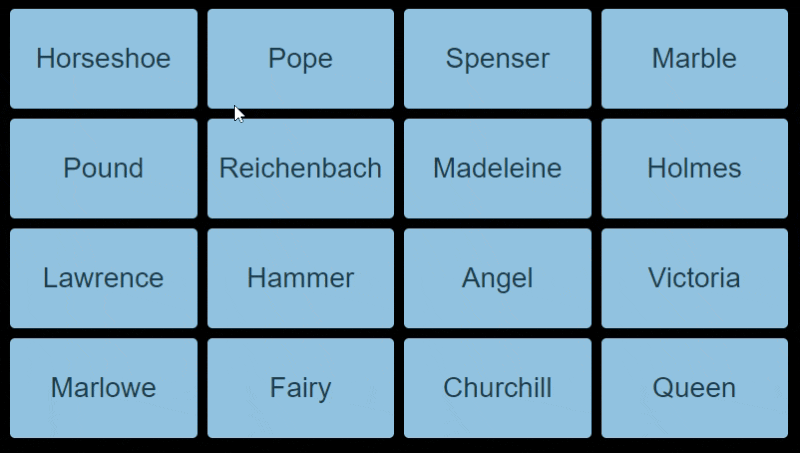

It seems at first glance that the fourth brick is not being selected.  This is because the moment the brick is selected the checkSelected function is called which then clears the selection.  I need to add a short delay before running the check code.  Thinking forwards a little bit, this is the point I would trigger any animation if the group is a valid selection.  I want to block the player from changing any selections during this animation so I added a lock flag to the game logic, setting the flag to true whenever a fourth brick is selected to prevent the player from interaction during this delay/animation.

The updated code with the locked flag and a timeout on the checkSelected call.

```javascript
// interaction
const WIDTH = 4;
let locked = false;
let group = 0;
let selected = [];
function selectBrick(brick) {
	if(!locked) {
		if(!selected.includes(brick)) {
			selected.push(brick);
			brick.html.classList.add("group" + group);

			if(selected.length==WIDTH) {
				locked = true;
				setTimeout(checkSelected, 350);
			}
		} else {
			selected = selected.filter(b => b!=brick);
			brick.html.classList.remove("group" + group);
		}
	}
}
function checkSelected() {
	// for now just clear selection
	selected.forEach(function(brick) {
		brick.html.classList.remove("group" + group);
	});
	selected = [];
	locked = false;
}
```

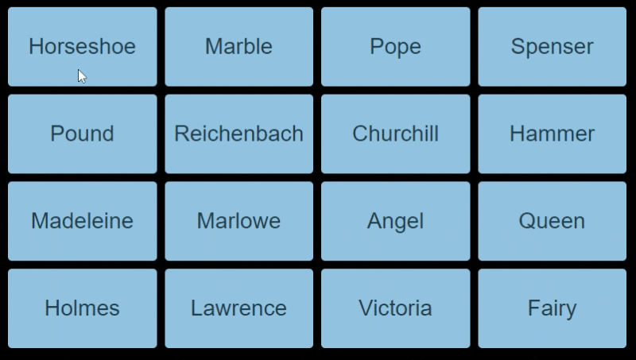

I used the array’s filter method instead of splice to remove the brick when required.  I’m not sure of the performance differences between filter and splice, in this example probably not a lot.  I do feel the filter code is a little less cryptic compared to splice.

## Moving Bricks

To check if the four selected bricks are all part of the same group I extract the link from the first selected brick, then use the array filter method to create a new array excluding any bricks who’s links match the first brick.  If they are all in the same group the length of this filtered array should be zero as all the bricks will have been excluded.

```javascript
let link = selected[0].link;
if(selected.filter(brick => brick.link!=link).length==0) {
	// a correct group
} else {
	// an incorrect group
}
```

I already have the code for when the group is incorrect which removes the group class from the bricks and clears the selection array.  When the group is correct I need to move these bricks to the top of the wall and let the player build the next group.

I started this by getting each brick to store which group number it is part of.  To help with sorting I wanted the initial value for each brick to be bigger than any valid group.  I therefore updated the loop that creates the brick array to set this group to 4 (I actually used the constant WIDTH just in case).  When checkSelected detects a valid group, it updates the group value in the selected bricks to the current group number.

```javascript
// a correct group
selected.forEach(function(brick) {
	brick.group = group;
});
```

Next I have to compute where each brick needs to move to.  For list/array manipulation problems like this I tend to start with the generic middle scenarios before reviewing the edge cases at the beginning and end of the list/array.

Consider this example where the “cakes” have already been selected and moved to the top row.  The “poets” have now been selected and the checkSelected code has determined it is a valid group and has therefore set the group for these elements to the current group number (1).

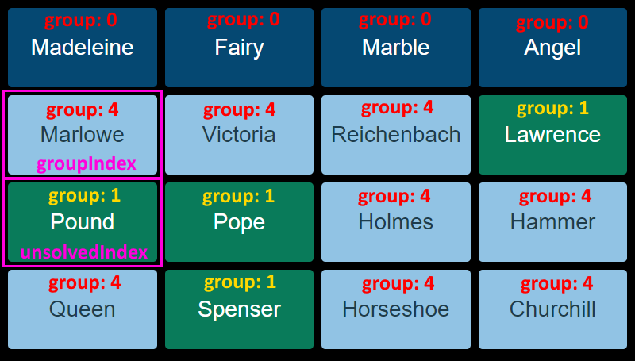

I use two variables, groupIndex and unsolvedndex, to track where elements for the current group and unsolved bricks should be moved to.  The groupIndex is initially set to the groupNumber multiplied by 4, and incremented by one each time it is used.  The unsolvedIndex works the same but starts 4 elements after the groupIndex.

I can now use the following logic to work out what the new index for each element should be:

*   For bricks who have a group smaller than the current group, they have already been moved to the top of the wall and can be left alone.
*   For bricks with a group equal to the current group number they need to be moved “up” to the next available row, the location of which is indicated by the groupIndex variable.
*   For bricks with a group number greater than the current group they need to be moved “down” to an available space as pointed to by the unsolvedIndex.

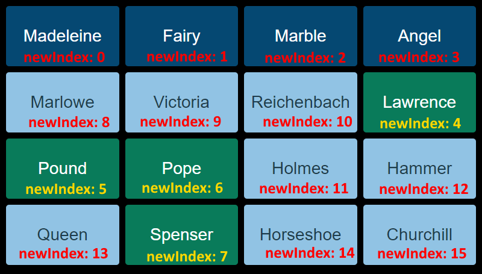

Sorting the array can then be done with the native array sort method and a compare function that references the new index.

```javascript
// calculate new position in the grid
let groupIndex = group * WIDTH;
let unsolvedIndex = groupIndex + WIDTH;
bricks.forEach(function(brick, index) {
	if(brick.group<group) {
		brick.newIndex = index;
	} else if(brick.group==group) {
		brick.newIndex = groupIndex++;
	} else {
		brick.newIndex = unsolvedIndex++;
	}
});
bricks.sort((a,b) => a.newIndex - b.newIndex);
```

As nice as it is to have a neatly sorted array, the bricks on the screen are still in their original order.  Before I get to animating the movement, I want to visually the logic above is working correctly.  I’ve therefore gone for a low tech approach of removing all the bricks and then re-adding them in the correct order.

```javascript
// move
bricks.forEach(function(brick) {
	wall.removeChild(brick.html);
});
bricks.forEach(function(brick) {
	wall.appendChild(brick.html);
});
```

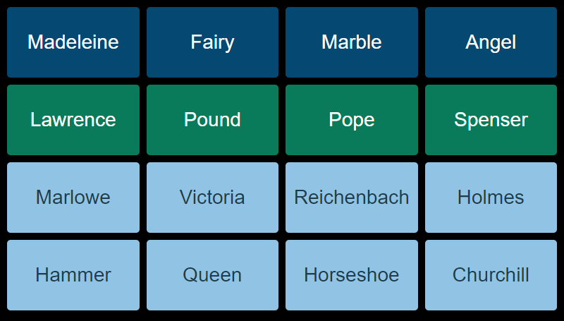

Before moving on let’s consider my edge cases.  Selecting the first group works without any changes to the code.  The first group is number 0, so groupIndex is computed to be 0 which is correct.  No bricks have a group set to less than 0 so that branch of code is never triggered, also correct.

Selecting the last group doesn’t throw any errors.  The code is robust enough that it does what you would expect, which is to leave the last four bricks where they are because they got sorted by default when the third group was selected.  However from a game play point of view this is not quite right.  I need to add a trap that after the third group is correctly selected,  the remaining four bricks are placed in the fourth group and the win condition is triggered.

For now I added the following code between the sort and move code to automatically select the last group.

```javascript
// next group
group++;

// is there only one group left?
if(group == WIDTH-1) {
	bricks.forEach(function(brick) {
		if(brick.group>group) {
			brick.group = group;
			brick.html.classList.add("group" + group);
		}
	});
	group++;
}
```

## Adding Animation

I used CSS 3 transitions for animation.  This part at least is remarkably straight forward.  I added a line to the CSS for bricks that means any changes to the top or left property will be animated over one second instead of taking effect instantly.  I used the ease timing function which means the movement will start slow, accelerate then slow down before coming to a stop.

```css
.brick {
	transition: top 1s ease, left 1s ease;
}
```

The top and left properties can then be manipulated via JavaScript and the browser will do the rest for me.  The hard part is knowing what to set the top and left properties to.

I modified the code that generates the wall and brick elements slightly so the bricks are nested inside an extra div that I call cell.

```javascript
bricks.forEach(function(brick) {
	brick.cell = html(wall, "div");
	brick.html = html(brick.cell, "div", "brick");
	/* ... */
});
```

I did this so the cell div would be positioned by the browser using the CSS grid layout, the brick would then be positioned relative to the cell.  I could therefore mess with the bricks position without fighting the grid.  By default the bricks would be positioned at the top left of the cell, so visually there would be no difference from what I had before.

I also updated the code that calculates the newIndex for each brick.  Once it has computed its new position in the array and before the array is sorted, it queries the brick currently at that index and saves the top and left positions of that brick’s cell relative to the grid.

```javascript
// calculate new position in the grid
bricks.forEach(function(brick, index) {
	/* ... */
	brick.newTop = bricks[brick.newIndex].cell.offsetTop;
	brick.newLeft = bricks[brick.newIndex].cell.offsetLeft;
});
```

I then replaced the temporary move code with a loop that changed the top and left properties of the brick element.  These are set to the difference between where the brick needs to be and where it currently is.

```javascript
// move
bricks.forEach(function(brick) {
	brick.html.style.top = (brick.newTop - brick.cell.offsetTop)+"px";
	brick.html.style.left = (brick.newLeft - brick.cell.offsetLeft)+"px";
});
```

Then the CSS transitions kick in and magic happens!

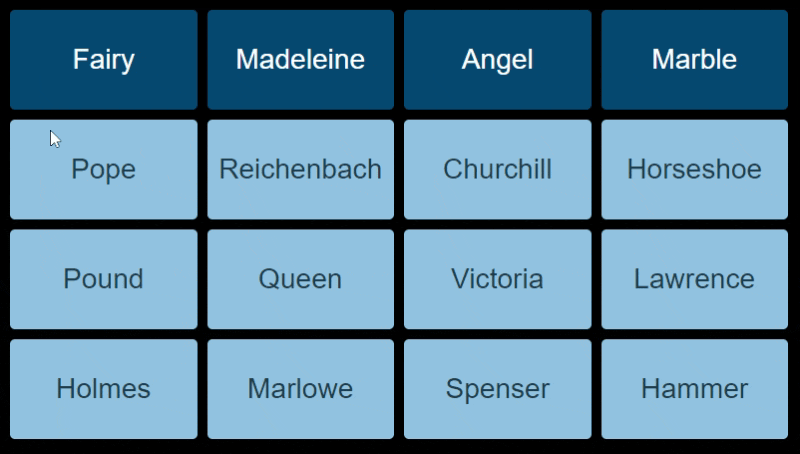

After the transition, I temporarily remove the bricks from the grid, reset the top and left to 0 and re-add them in the correct order.  The transition does not apply when I reset the top and left properties as the element is not part of the DOM at the time.  At this point everything should be reset and ready for the next group.

```javascript
setTimeout(function() {
	bricks.forEach(function(brick) {
		wall.removeChild(brick.cell);
		brick.html.style.top = "0px";
		brick.html.style.left = "0px";
		wall.appendChild(brick.cell);
	});
}, 1000);
```

## Winning

Once the final group has been completed, I added a way for the player to confirm they had the link correct (or if they solved the puzzle by trial and error let them know what the link was).

I did this by shrinking the wall down to two thirds width (using transitions of course) and then using the right third of the screen to show the links for each group.  Each link is initially hidden allowing the player to control when the link is revealed.

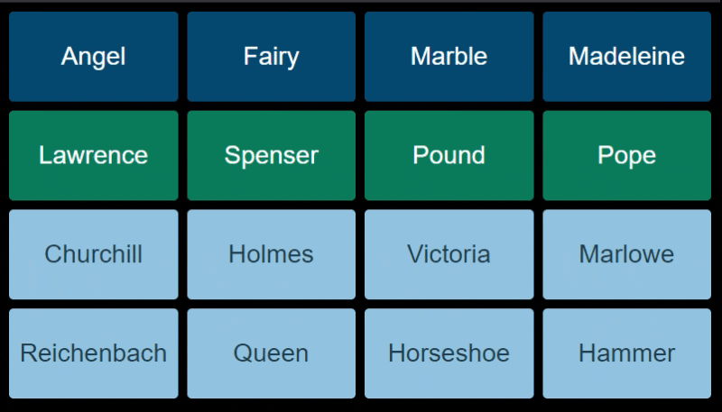

When playing on a phone in portrait mode, this makes the text unnecessarily small considering all the free space under the wall.

In the past I would have solved this problem using JavaScript to compare the window width and height and add a class such as “wide” or “tall” to the top level container which I would then use in the CSS to display the links either to the side or below the grid.  This check would have to be made on page load and whenever the screen size changed.

Using CSS 3 media queries, none of this JavaScript is required and the logic can be baked right into the CSS.

```css
@media screen and (orientation:landscape) {
	.wall.player.won {
		width: 66%;
	}
	.wall.links {
		width: 33%;
	}
}
```

## Editor

A big goal for me in this project was to let people create their own walls.  My approach to this was to create an editor that generates a URL with the data for the wall encoded in it that could then be shared with friends etc.

The HTML for the editor is a simplified version of grid from the main wall.  It borrows a lot of the CSS but doesn’t scale to fit the page or have any animation.  Each cell has an input with transparent backgrounds so the grid colours show through.

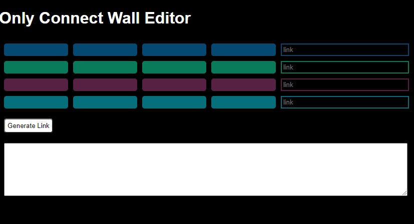

The important code is behind the “Generate Link” button.  Initially I was going to store the data using JSON, however I wanted to keep the string length down so switched to a simple delimited string.  The data is stored in the following format:

```
4|link0;clue0_0;clue0_1;clue0_2;clue0_3|link1;clue1_0...
```

One idea I abandoned was the ability for different size grids.  The number at the start of the string would indicate the width and height of the grid, as it stands this would always be a 4 but I left it there, in case I change my mind.

I use the array reduce function to turn the array of groups and clues into the encoded string.  Each input is validated to ensure it is not blank, a duplice or contains the semicolon or pipe characters (as this would break the encoding).  If the data is encoded without error I then use the btoa function to base64 encode the data which makes it both URL safe and obfuscates it.

```javascript
try {
	// duplicate tracking
	let links = {};
	let clues = {};

	// fields to data string
	let data = groups.reduce(function(acc, group) {
		return acc + "|" + group.clues.reduce(function(acc, clue) {
			return acc + ";" + valididateInput("clue", clues, clue);
		}, valididateInput("link", links, group.link));
	}, "4");

	// turn into url
	linkBox.value =
		location.origin +
		location.pathname.replace("edit.html", "play.html") +
		"?" + btoa(data);
} catch (e) {
	linkBox.value = "Error!\n"+ e;
}
```

The reverse of this process is handled by the getData function.  This reads the data from the URL, converts it from base64 using the atob function, then a combination of split and map to create the array of groups required for the main wall.  It does some basic validation, checking the string starts with a 4 and there are the correct number of groups.  If there are any problems the function returns null and the wall will switch back to a hardcoded default wall.

```javascript
function getData() {
	let data = atob(location.search.substr(1));
	let groups = data.split("|");
	if(groups[0]==="4" && groups.length==5) {
		return groups.slice(1).map(function(group) {
			var clues = group.split(";");
			return {
				link: clues[0],
				clues: clues.slice(1)
			};
		});
	}
}
```

## Improvements

At this point I’m ready to call this project complete.  It’s functional and does what I need it to do.

That said there are always improvements I could make, here are some obvious ones that are missing when compare to the TV show:

*   Sound.  An error buzz when you create an invalid selection and a pleasing woosh noise when you get a correct group.
*   Add a timer to add some extra pressure.
*   Once you get down to the last two groups, make it so you can only enter three incorrect guesses, before failing.

In addition, I also had some thoughts about making it more accessible by adding a hint system which reveals the link for one of the undiscovered groups if you have too many incorrect guesses.

## Conclusion

I’ve had fun going back to basics and exploring what is possible with native JavaScript and CSS.  In general I’m impressed with how much has changed in a decade.  In an industry that is constantly moving it can be hard to keep up with the current developments especially if you have a large back catalog that needs to be maintained.

I am particularly impressed I’ve not written a single line of code to deal with browser inconsistencies.  I need to explore the grid layout some more, I only scratch the surface of what it can do.  I’ll be using the observer API quite a bit as that saves a tone of code.  I need another side project where I can play with CSS transitions and animations a bit more.  Getting stuff to slide around the screen was fun, but what else can I do?

The next time I go to habitually include the same set of libraries I’ve been using for years, I will take a second to review and ask if I can do without them.  Not needing to load a library is going to save time and bandwidth, and native CSS and JavaScript is going to run faster than a library that needs to be interpreted.

I’m not writing off all libraries, they have their place but if like me you started using a library to smooth over the problems with browsers, you might be pleasantly surprised to find you don’t need that library any more.  That is unless you still need to support Internet Explorer.

## Links

You can find the Only Connect TV show on BBC2 and the iPlayer.

You can find the source code for this project on [github](https://github.com/terrychild/only-connect).

Here are a number of wall's my friends an I have created you can have a go at:
* [The one that triggered this whole project](http://www.moohar.com/only-connect/play.html?NHxNZXRhbHM7bGVhZDtnb2xkO2NvcHBlcjt6aW5jfEluc2VjdHM7d2FzcDtmbHk7Y3JpY2tldDtiZWV0bGV8X19fX21hbjtzcGlkZXI7c3VwZXI7YW50O2JhdHxNb25vbG9weSBwaWVjZXM7Y2FyO2Jvb3Q7aXJvbjtkb2c=).
* [The difficult sequel](http://www.moohar.com/only-connect/play.html?NHxTY290dGlzaCBCYW5kcztCZWxsZSAmIFNlYmFzdGlhbjtJZGxld2lsZDtUZXhhcztUcmF2aXN8UmVuYWlzc2FuY2UgYXJ0aXN0cztSYXBoYWVsO0RvbmF0ZWxsbztCb3R0aWNlbGxpO01pY2hlbGFuZ2Vsb3xBc3Nhc3NpbmF0aW9uIHZpY3RpbXM7SkZLO0ZyYW56IEZlcmRpbmFuZDtNYWhhdG1hIEdhbmRoaTtNYXJ0aW4gTHV0aGVyIEtpbmd8QWlycG9ydHM7U2NoaXBvbDtDaGFybGVzIERlIEdhdWxsZTtHYXR3aWNrO0xlb25hcmRvIERhIFZpbmNp).
* [One for movie fans](http://www.moohar.com/only-connect/play.html?NHxCYXRtYW47Q2xvb25leTtCYWxlO0tpbG5lcjtLZWF0b258Qm9uZDtDb25uZXJ5O01vb3JlO0Jyb3NuYW47Q3JhaWd8SmFjayBSeWFuO0JhbGR3aW47Rm9yZDtBZmZsZWNrO1BpbmV8RHVtYmxlZG9yZTtIYXJyaXM7R2FtYm9uO0xhdztSZWdibw==).
* [And one more](http://www.moohar.com/only-connect/play.html?NHxUb3AgX19fX187R3VuO1Nob3A7SGF0O0dlYXJ8UXVhcmtzO1N0cmFuZ2U7Q2hhcm07VG9wO0Rvd258UGl4YXIgZmlsbXM7VXA7U291bDtCcmF2ZTtDYXJzfERuRCBDaGFyYWN0ZXIgdHJhaXRzO0FnZ3Jlc3NpdmU7RGlzaG9uZXN0O1BvbGl0ZTtQYXNzaW9uYXRl).

You can access the editor [here](http://www.moohar.com/only-connect/edit.html).